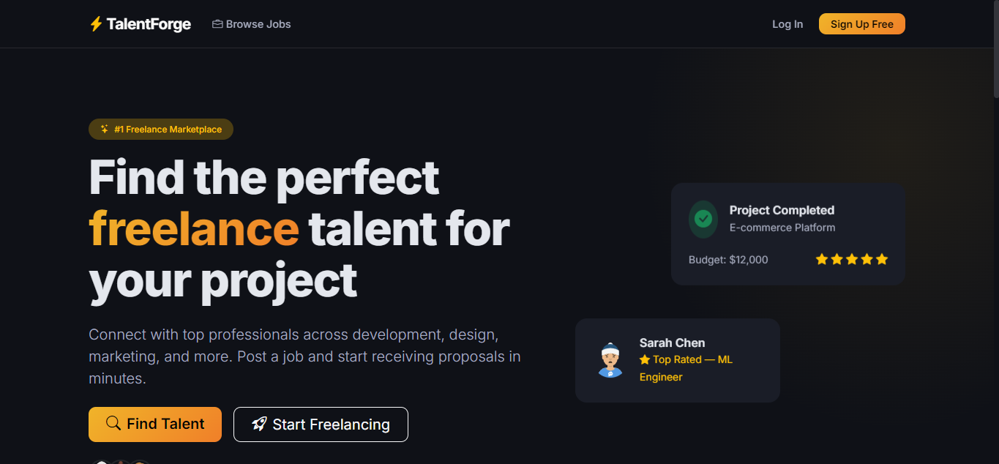

# TalentForge — Freelance Job Marketplace

A modern, full-featured freelance job marketplace starter template built with Node.js, Express, MySQL, and Bootstrap 5. Use it as a foundation for building your own freelancing platform.

   



## 🛡️ Security Training & Education

**TalentForge is purposefully built as a vulnerable-by-design application for security training and educational purposes.** 

It mirrors a realistic production environment without explicit hints, CTF banners, or flags. This makes it an ideal target for:
- Penetration testing practice
- Security auditing and code review training
- Defensive architecture research

*Note: This application should only be deployed in a localized or controlled environment for training. Do not use this as a template for a real-world production site without a full security audit.*

## Features

- **User Registration & Login** — JWT-based authentication with secure password hashing
- **Job Listings** — Post, browse, search, and filter freelance jobs
- **Application System** — Apply to jobs with cover letters and track your applications
- **User Profiles** — Customizable profiles with bio, skills, and avatar
- **Messaging** — Real-time threaded messaging between freelancers and clients
- **Reviews & Ratings** — Leave reviews on completed projects
- **Payments** — Account balance management, withdrawals, and coupon codes
- **Admin Dashboard** — User management and platform oversight
- **Responsive Design** — Mobile-first UI with Bootstrap 5

## Quick Start

### Prerequisites

- [Docker](https://www.docker.com/get-started) & Docker Compose installed

### Run

```bash
git clone https://github.com/amirqusairy99/ionic-quasar.git
cd talentforge
docker-compose up --build
```

The app will be available at **http://localhost:3000**

### Default Accounts

| Email | Password | Role |
|-------|----------|------|
| admin@talentforge.com | admin123 | Admin |
| john@example.com | password123 | User |
| jane@example.com | password123 | User |

## Project Structure

```
talentforge/
├── config/          # Database configuration
├── middleware/       # Auth & validation middleware
├── routes/          # API and page routes
├── views/           # EJS templates
│   └── partials/    # Reusable template partials
├── public/          # Static assets (CSS, JS, images)
├── init.sql         # Database schema & seed data
├── server.js        # Application entry point
├── Dockerfile
├── docker-compose.yml
└── package.json
```

## Tech Stack

- **Backend**: Node.js + Express
- **Database**: MySQL 8.0 with raw queries for maximum flexibility
- **Auth**: JWT tokens with bcrypt password hashing
- **Templates**: EJS with Bootstrap 5
- **Dev Tools**: Nodemon for hot-reload, Docker for containerization

## API Endpoints

| Method | Endpoint | Description |
|--------|----------|-------------|
| POST | `/api/v1/auth/register` | Register a new account |
| POST | `/api/v1/auth/login` | Log in and receive JWT |
| GET | `/api/v1/jobs` | List all jobs (with search & sort) |
| POST | `/api/v1/jobs` | Create a new job posting |
| GET | `/api/v1/jobs/:id` | Get job details |
| POST | `/api/v1/applications` | Apply to a job |
| GET | `/api/v1/messages` | Get message threads |
| POST | `/api/v1/payments/withdraw` | Withdraw funds |

## Configuration

Environment variables are managed via `.env` file or Docker Compose:

| Variable | Default | Description |
|----------|---------|-------------|
| `DB_HOST` | `db` | MySQL host |
| `DB_USER` | `tfuser` | MySQL username |
| `DB_PASSWORD` | `tfpass_2024` | MySQL password |
| `DB_NAME` | `talentforge` | Database name |
| `JWT_SECRET` | — | Secret key for JWT signing |
| `PORT` | `3000` | Server port |

## Contributing

1. Fork the repository
2. Create your feature branch (`git checkout -b feature/amazing-feature`)
3. Commit your changes (`git commit -m 'Add amazing feature'`)
4. Push to the branch (`git push origin feature/amazing-feature`)
5. Open a Pull Request

## License

This project is licensed under the MIT License. See [LICENSE](LICENSE) for details.
